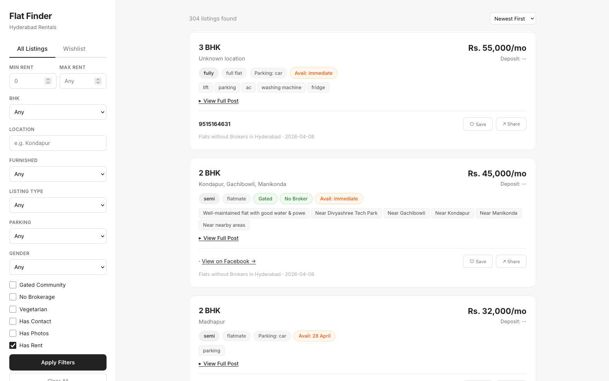
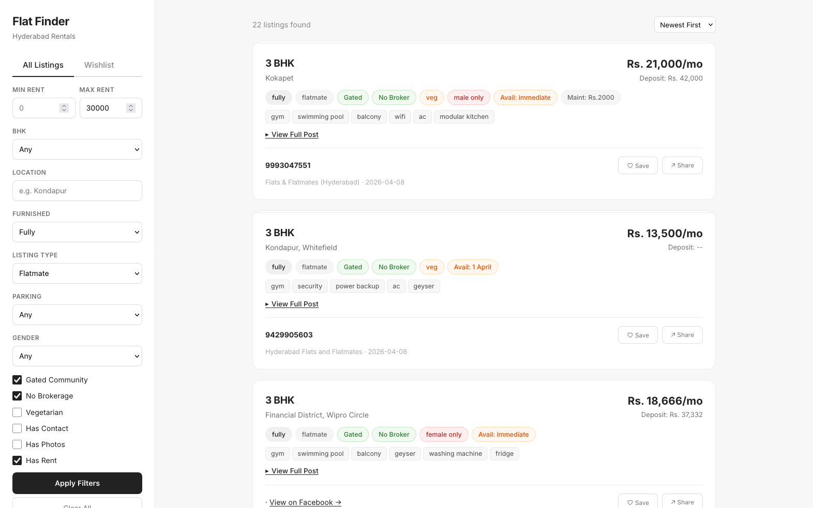
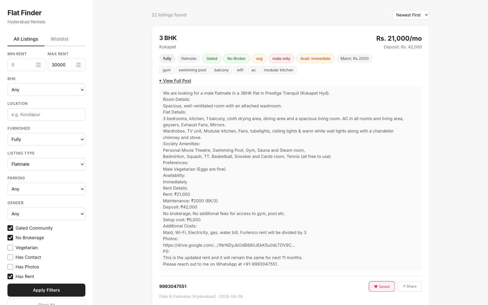

# FB Flat Finder

Scrapes Facebook housing groups, parses unstructured posts into structured data using a cascade of regex + fine-tuned LLM, and serves a searchable web UI.

Built to solve flat-hunting in Hyderabad — instead of scrolling 16 Facebook groups daily, get a filterable dashboard.

## How It Works

```
Facebook Groups (16 groups, Playwright)
        │
        ▼
┌─────────────────┐
│  Cascade Parser  │
│  1. Regex        │  → rent, BHK, sqft, phone (fast, free)
│  2. Fine-tuned   │  → furnished, gated, amenities (Gemma 3 1B, LoRA)
│  3. Enrichment   │  → keywords (parking, facing, floor)
└────────┬────────┘
         │
         ▼
   PostgreSQL (Supabase)
         │
         ▼
   Flask Web UI (Render)
```

## Features

- Scrapes 16 Hyderabad Facebook housing groups
- Parses Hindi/English mixed posts into structured fields (BHK, rent, location, furnishing, etc.)
- Fine-tuned Gemma 3 1B (LoRA) for ambiguous fields — runs locally on Apple Silicon via MLX
- Cascade parsing: regex handles 85% of fields, LLM fires only when needed (~200ms avg)
- PostgreSQL storage with dedup (Supabase) + SQLite fallback for local dev
- Flask web UI with filters (rent range, BHK, location, furnishing)
- Wishlist feature
- GitHub Actions for CI, Render for deployment

## Stack

| Component | Technology |
|-----------|-----------|
| Scraping | Python, Playwright (async) |
| Parsing | Regex → fine-tuned Gemma 3 1B (LoRA/MLX) → keyword enrichment |
| Database | PostgreSQL (Supabase) / SQLite |
| Web UI | Flask, Jinja2 |
| Deployment | Render (web), GitHub Actions (CI) |
| Fine-tuning | HuggingFace transformers, PEFT, LoRA, trained on Apple Silicon |

## Setup

```bash
# Clone
git clone https://github.com/MinotaurG/fb-flat-finder.git
cd fb-flat-finder

# Install
python -m venv venv && source venv/bin/activate
pip install -r requirements.txt
playwright install chromium

# Configure
cp .env.example .env  # Add DATABASE_URL if using Supabase
# Export Facebook cookies to cookies.json (use a browser extension)
# Edit groups.yaml to point at your city's groups

# Run scraper
python scraper.py

# Run web UI
flask run
```

## Fine-Tuning

Training data: 200+ manually labeled listings in `training_data_chat.jsonl` format.

```bash
python finetune_hf.py  # Trains on MPS (Apple Silicon) or CPU
```

Produces a LoRA adapter that runs locally via MLX — zero API costs for inference.

## Screenshots

### Dashboard — 304 listings, filterable


### Filters in action — fully furnished, gated, no broker, under 30k


### Expanded listing — raw Facebook post parsed into structured fields


## License

MIT
